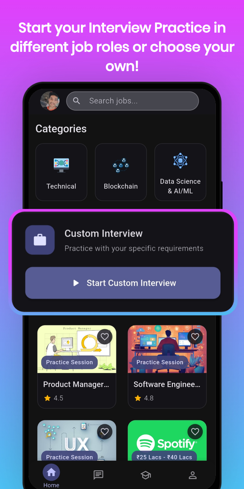
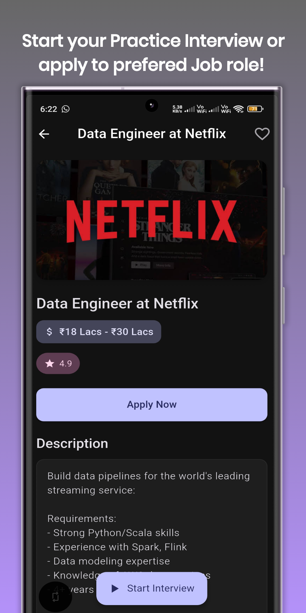
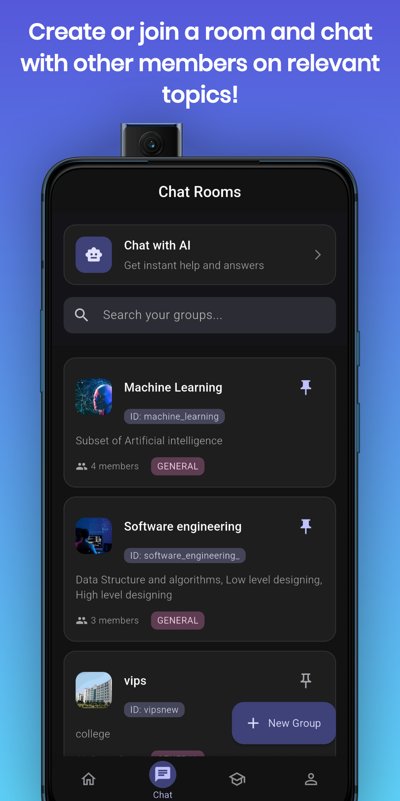
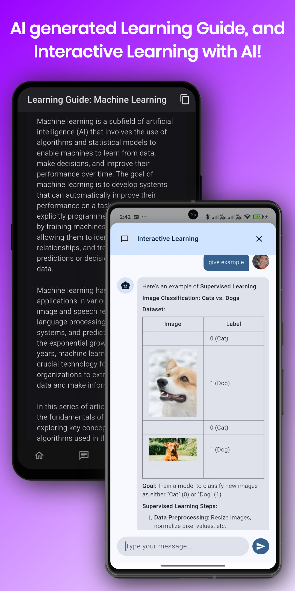
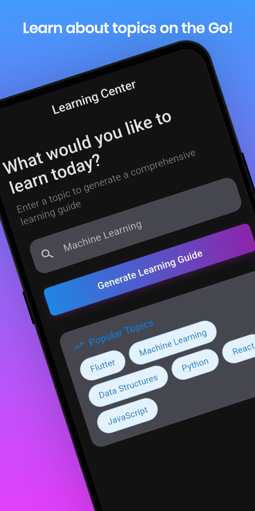
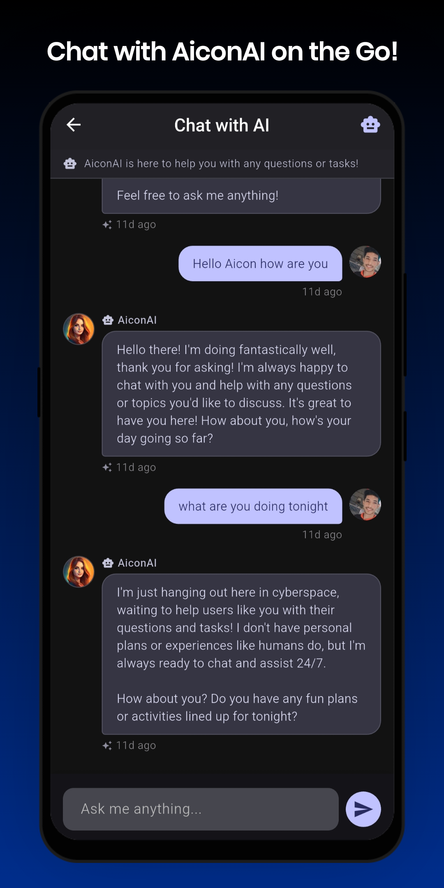
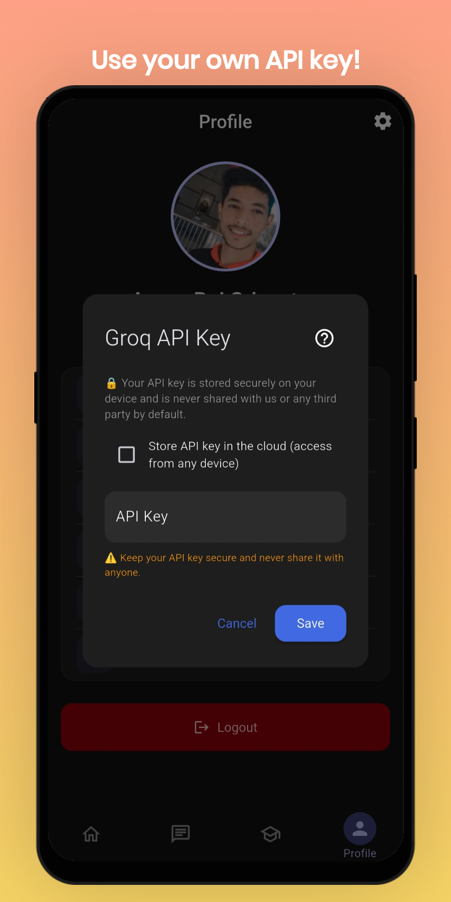
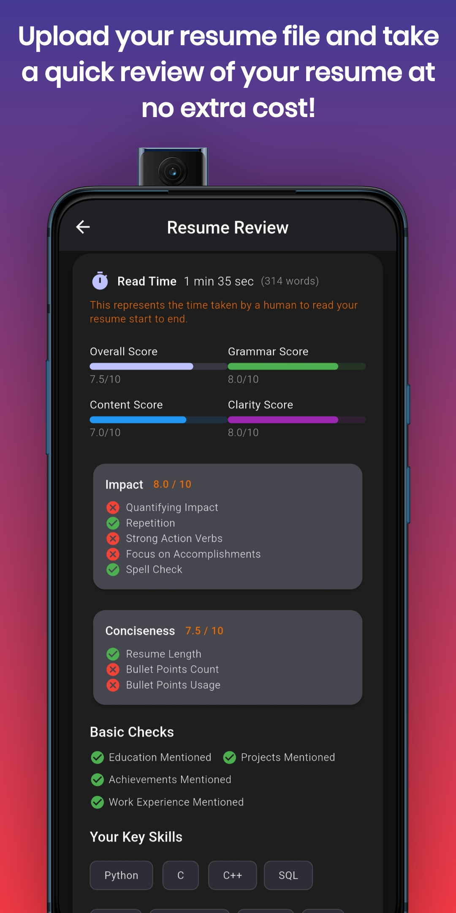

# HireIQ - AI-Powered Interview Preparation Platform

<div align="center">

<!-- Hero Screenshot -->


**An intelligent mobile application designed to help job seekers prepare for interviews through AI-powered practice sessions, resume reviews, and personalized learning experiences.**

[Features](#-features) • [Tech Stack](#-tech-stack) • [Architecture](#-architecture) • [Installation](#-installation) • [Screenshots](#-screenshots)

</div>

---

## 📸 Screenshots

<div align="center">

### Main App Flows





<br/>

### Additional Views





<br/>

### Extra Views




</div>

---

## 📱 Overview

HireIQ is a comprehensive interview preparation platform built with Flutter that leverages AI technology to provide users with realistic interview experiences. The application offers AI-powered mock interviews, resume analysis, interactive learning modules, and collaborative features to help users excel in their job search journey.

### Key Highlights

- 🤖 **AI-Powered Interviews**: Practice with intelligent AI interviewers across multiple job roles and difficulty levels
- 📄 **Resume Review**: Get instant AI-powered feedback on your resume with actionable improvement suggestions
- 📚 **Learning Hub**: Access curated learning content, tutorials, and resources for skill development
- 💬 **Real-time Chat**: Collaborate with other users through group chat rooms and messaging
- 🔐 **Secure Authentication**: Firebase-based authentication with Google Sign-In support
- 🌙 **Dark Mode**: Beautiful UI with light and dark theme support
- 📱 **Cross-Platform**: Native Android and iOS applications

---

## ✨ Features

### Core Functionality

- **AI Interview Practice**
  - Role-specific interview questions (Software Engineer, Data Scientist, Product Manager, etc.)
  - Multiple difficulty levels (Beginner, Intermediate, Advanced)
  - Real-time AI responses powered by Groq API
  - Voice and text-based interview modes
  - Interview history and performance tracking

- **Resume Review & Analysis**
  - PDF resume upload and parsing
  - AI-powered content analysis
  - Detailed feedback on formatting, content, and ATS optimization
  - Actionable improvement suggestions
  - Resume comparison and benchmarking

- **Learning & Development**
  - Curated learning paths for different roles
  - Interactive tutorials and guides
  - Skill assessment and progress tracking
  - Personalized recommendations

- **Social Features**
  - Group chat rooms for collaboration
  - User profiles and member management
  - Favorites system for saving preferred content
  - Real-time notifications via Firebase Cloud Messaging

- **User Experience**
  - Intuitive navigation with bottom tab bar
  - Advanced search and filtering
  - Offline mode with network status indicators
  - Secure API key management with encryption
  - Customizable profiles with photo upload

---

## 🛠 Tech Stack

### Frontend
- **Framework**: Flutter 3.0+
- **Language**: Dart 3.7+
- **State Management**: Provider
- **UI Components**: Material Design & Cupertino

### Backend & Services
- **Authentication**: Firebase Authentication
- **Database**: Cloud Firestore
- **Storage**: Firebase Storage
- **Notifications**: Firebase Cloud Messaging (FCM)
- **AI Integration**: Groq API
- **File Handling**: PDF parsing, image caching

### Key Packages
```yaml
- firebase_core, firebase_auth, cloud_firestore
- google_sign_in
- provider (State Management)
- flutter_secure_storage
- file_picker, read_pdf_text
- connectivity_plus
- cached_network_image
- http, crypto, encrypt
```

### Development Tools
- **IDE**: Android Studio, VS Code
- **Version Control**: Git
- **Build Tools**: Gradle, CocoaPods
- **CI/CD**: Firebase Functions

---

## 🏗 Architecture

### Project Structure
```
lib/
├── auth/              # Authentication screens
├── models/            # Data models
├── providers/         # State management (Theme, Network)
├── screens/           # UI screens
│   ├── home_screen.dart
│   ├── interview_screen.dart
│   ├── resume_review_screen.dart
│   ├── learn_screen.dart
│   ├── chat_rooms_screen.dart
│   └── profile_screen.dart
├── services/          # Business logic
│   ├── api_key_service.dart
│   ├── chat_service.dart
│   └── content_moderation_service.dart
├── widgets/           # Reusable components
└── utils/             # Utility functions
```

### Key Design Patterns
- **Provider Pattern**: For state management
- **Repository Pattern**: For data access
- **Service Layer**: For business logic separation
- **Widget Composition**: For reusable UI components

---

## 🚀 Installation

### 📥 Direct Android APK Download

You can directly download the latest built Android APK from this repository:

- [Download HireIQ Android APK](assets/app-armeabi-v7a-release.apk)

### Prerequisites
- Flutter SDK (3.0 or higher)
- Dart SDK (3.7 or higher)
- Android Studio / Xcode (for mobile development)
- Firebase project setup
- Groq API key

### Setup Instructions

1. **Clone the repository**
   ```bash
   git clone https://github.com/aman-raj-srivastva/HireIQ-App.git
   cd HireIQ-App
   ```

2. **Install dependencies**
   ```bash
   flutter pub get
   ```

3. **Configure Firebase**
   - Create a Firebase project at [Firebase Console](https://console.firebase.google.com)
   - Add Android and iOS apps to your Firebase project
   - Download `google-services.json` (Android) and `GoogleService-Info.plist` (iOS)
   - Place them in the appropriate directories

4. **Configure API Keys**
   - Copy `api_keys.example.env` to `api_keys.env`
   - Fill in your Firebase and Groq API keys
   - **Note**: `api_keys.env` is gitignored for security

5. **Run the application**
   ```bash
   flutter run
   ```

### Platform-Specific Setup

#### Android
- Minimum SDK: 23
- Target SDK: Latest
- Configure signing keys in `android/key.properties` (gitignored)

#### iOS
- Minimum iOS: 12.0
- Configure signing in Xcode
- Add `GoogleService-Info.plist` to Runner directory

---

## 🔒 Security

- All API keys stored securely using `flutter_secure_storage`
- Sensitive configuration files are gitignored
- Firebase security rules implemented
- Encrypted API key storage with user-defined passphrases
- Content moderation for user-generated content

---

## 🧪 Testing

```bash
# Run unit tests
flutter test

# Run integration tests
flutter test integration_test/
```

---

## 📦 Build & Deployment

### Android
```bash
flutter build apk --release
# or
flutter build appbundle --release
```

### iOS
```bash
flutter build ios --release
```

---

## 🤝 Contributing

This is a personal project, but suggestions and feedback are welcome!

1. Fork the repository
2. Create a feature branch (`git checkout -b feature/AmazingFeature`)
3. Commit your changes (`git commit -m 'Add some AmazingFeature'`)
4. Push to the branch (`git push origin feature/AmazingFeature`)
5. Open a Pull Request

---

## 📝 License

This project is private and proprietary. All rights reserved.

---

## 👤 Author

**Aman Raj Srivastva**
- GitHub: [@aman-raj-srivastva](https://github.com/aman-raj-srivastva)
- Repository: [HireIQ-App](https://github.com/aman-raj-srivastva/HireIQ-App)

---

## 🙏 Acknowledgments

- Flutter team for the amazing framework
- Firebase for backend services
- Groq for AI capabilities
- All open-source package contributors

---

<div align="center">

**Made with ❤️ using Flutter**

⭐ Star this repo if you find it helpful!

</div>
